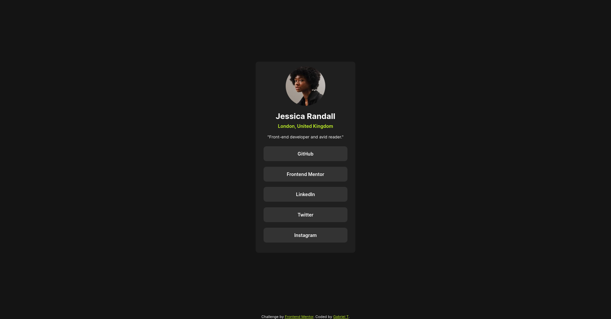

# Frontend Mentor - Social links profile solution

This is a solution to the [Social links profile challenge on Frontend Mentor](https://www.frontendmentor.io/challenges/social-links-profile-UG32l9m6dQ). Frontend Mentor challenges help you improve your coding skills by building realistic projects. 

## Table of contents

- [Overview](#overview)
  - [The challenge](#the-challenge)
  - [Screenshot](#screenshot)
  - [Links](#links)
- [My process](#my-process)
  - [Built with](#built-with)
  - [What I learned](#what-i-learned)
- [Author](#author)

## Overview

### The challenge

Users should be able to:

- See hover and focus states for all interactive elements on the page
- Project time limit of 2 hours (Done in 60 minutes)

### Screenshot

### Links

- Solution URL: 
- Live Site URL: 

## My process

1. Make a github repository for the project
2. Get all the needed files inside the repository
3. Consult the desired preview
4. Draw the structure of the website on paper
5. Break down the parts of the website into smaller bits
6. Build the HTML structure of the page
7. Style each section using CSS
8. Fix and refine smaller details

### Built with

- Semantic HTML5 markup
- CSS custom properties
- Flexbox

### What I learned

1. How to position a footer at the bottom of the page while having a container. To do so, I wraped the container inside another div to properly use flex:1 without
the letting the container to grow all the way down. 

## Author

- Website - [Gabriel T](https://github.com/tanasegabrielw?tab=repositories)
- Frontend Mentor - [@tanasegabrielw](https://www.frontendmentor.io/profile/tanasegabrielw)

